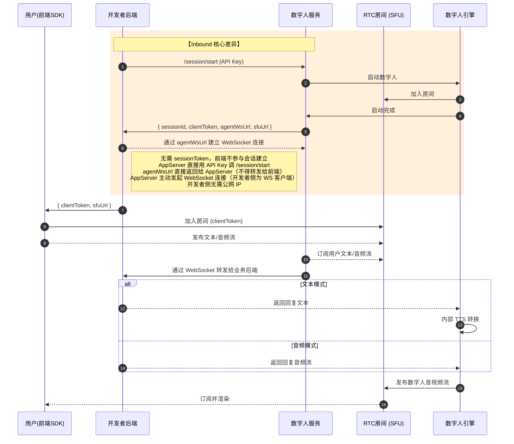
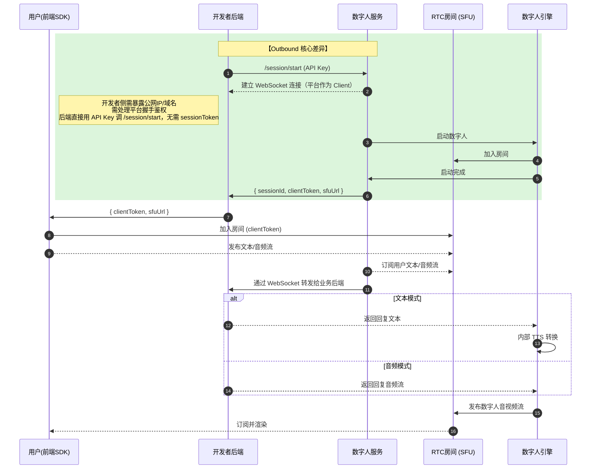
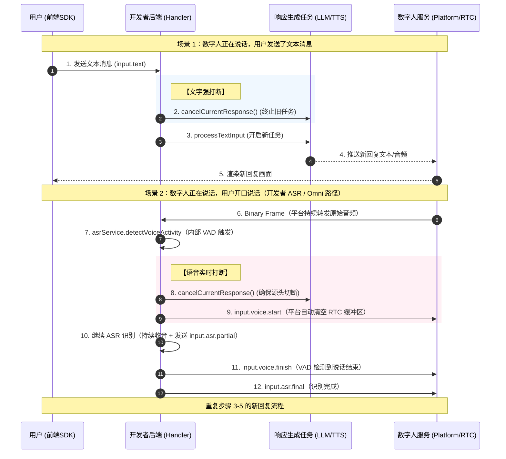

# 协议综述

[English](./PROTOCOL.md) | **中文**

本协议专注于 Live Avatar 平台（coordinator）与开发者后端（agent）之间的 WebSocket 点对点通信，包含文本、音频、图片内容。

## 场景支持考量

1. 消息类型语义化，方便理解。
2. 支持流式数据传输。
3. 抗乱序。
4. 支持多会话扩展。

## 文本消息类型命名规范

我们用 event 来指代消息类型，为了防止消息类型增长过程中出现的混乱，需要制定一系列规范。

### 三段式语义

```
<domain>.<action>[.<stage>]
```

#### 1️⃣ 第一层：Domain（领域分类）

| Domain | 含义 |
| --- | --- |
| session | 会话生命周期 |
| input | 用户输入 |
| response | 模型输出 |
| control | 控制信号 |
| system | 系统行为 |
| error | 错误 |
| tool（未来）| 工具调用 |

---

#### 2️⃣ 第二层：Action（动作）

描述"做什么"

| Action      | 示例                 |
| ----------- | ------------------ |
| init        | session.init       |
| ready       | session.ready      |
| text        | input.text         |
| asr         | input.asr          |
| chunk       | response.chunk     |
| done        | response.done      |
| cancel      | response.cancel    |
| interrupt   | control.interrupt  |
| prompt      | system.prompt      |
| idleTrigger | system.idleTrigger |

---

#### 3️⃣ 第三层：Stage（阶段，可选）

用于"流式/状态"

| Stage | 示例 |
| --- | --- |
| partial | input.asr.partial |
| final | input.asr.final |

---

# 文本协议分场景设计

## WebSocket Inbound/Outbound 模式

### Inbound 模式

Inbound 模式是指数字人服务提供 WebSocket 服务地址，开发者服务来请求数字人服务提供的 WebSocket 服务。

它的整体执行时序如下：



### Outbound 模式

Outbound 模式是指开发者服务提供 WebSocket 服务地址，数字人服务来请求开发者服务提供的 WebSocket 服务。

它的整体执行时序如下：



### 两种模式的适用场景

- 如果你的业务对**极低延迟和大规模并发稳定性**有要求，且你有成熟的运维团队能暴露稳定的公网端点，**Outbound** 在架构美感和资源受控度上更优。
- 如果你追求**快速交付、内网安全**，且不希望处理复杂的防火墙穿透问题，**Inbound** 带来的微小性能损失在 Java 异步框架（如 Netty/WebFlux）下几乎可以忽略不计。

> **sessionToken 架构说明**
>
> Inbound 和 Outbound 两种模式采用相同的认证模式：**开发者后端**直接用 API Key 调用 `/session/start`，获得 `clientToken + sfuUrl` 后分发给前端。两种模式均**不需要** `sessionToken`（即通过 `/auth/getAuthToken` 获取的令牌）。
>
> `sessionToken` 仅用于轻量托管模式（全托管、API Key 托管），在这些模式下**前端**直接调用 `/session/start`，后端仅充当令牌中转——既避免 API Key 暴露在客户端，又无需后端深度介入。

---

## 场景一：WebSocket 全流程（标准路径）

### 1️⃣ 建立连接

#### Client（数字人服务）→ Server（开发者服务）

```json
{
  "event": "session.init",
  "data": {
    "sessionId": "sess_123",
    "userId": "u_1"
  }
}
```

---

#### （开发者服务）→ Client（数字人服务）

```json
{
  "event": "session.ready"
}
```

---

#### Client（数字人服务）→ Server（开发者服务）— scene.ready 桥接转发

用户前端加入 LiveKit 房间、数字人画面就绪后，user 通过 Data Channel 发送 `scene.ready`。coordinator 收到后通过 WebSocket 桥接转发给 agent，告知画面已就绪、可以开始对话。

```json
{
  "event": "scene.ready"
}
```

> 此为单向通知，agent 无需回复。

---

### 2️⃣ 心跳

依靠 WebSocket 协议标准控制帧。

遵循标准 WebSocket 协议（RFC 6455）：

- **Ping（0x9）**：服务器可能会向客户端发送 Ping 帧。
- **Pong（0xA）**：客户端收到 Ping 帧后，必须自动回复 Pong 帧。

---

### 3️⃣ 用户输入文本

数字人服务发送文本输入消息。

```json
{
  "event": "input.text",
  "requestId": "req_1",
  "data": {
    "text": "你叫什么名字"
  }
}
```

---

### 4️⃣ 开发者服务流式输出

#### 输出开始（可选）

可选事件。如果你需要对数字人服务提供的 TTS 进行语速、音量、情绪等的控制，可以在发送 chunk 事件前发送该消息。

```json
{
  "event": "response.start",
  "requestId": "req_1",
  "responseId": "res_1",
  "data": {
    "audioConfig": {
      "speed": 1.0,
      "volume": 1.0,
      "mood": "neutral"
    }
  }
}
```

**speed 取值对照表**

| 值 | 含义 |
| --- | --- |
| 0.5 | 很慢（适合教学/老人）|
| 0.8 | 稍慢 |
| 1.0 | 正常语速（默认）|
| 1.2 | 稍快 |
| 1.5 | 很快 |
| 2.0 | 极限快（不保证清晰）|

**volume 取值对照表**

| 值 | 含义 |
| --- | --- |
| 0.0 | 静音 |
| 0.5 | 较小 |
| 1.0 | 标准（默认）|
| 1.2 | 偏大 |
| 1.5 | 最大（可能爆音）|

**mood 可选取值（可扩展）**：`neutral` · `happy` · `sad` · `angry` · `excited` · `calm` · `serious`

---

#### chunk（文本）

```json
{
  "event": "response.chunk",
  "requestId": "req_1",
  "responseId": "res_1",
  "seq": 12,
  "timestamp": 1710000000000,
  "data": {
    "text": "你好"
  }
}
```

---

#### done（文本）

```json
{
  "event": "response.done",
  "requestId": "req_1",
  "responseId": "res_1"
}
```

---

requestId → responseId = 1:N

seq = response 内递增。

response 可以是多个 agent 回复的。

---

### 5️⃣ 状态同步（数字人服务发送）

```json
{
  "event": "session.state",
  "seq": 12,
  "timestamp": 1710000000000,
  "data": {
    "state": "SPEAKING"
  }
}
```

seq = session 内递增。所有 state 值（后续可能扩展）：

| 状态 | 谁在说话 | 系统行为 |
| --- | --- | --- |
| **IDLE** | 无 | 等待输入 |
| **LISTENING** | 用户 | ASR 收音 |
| **THINKING** | 系统（脑）| LLM/TTS 准备 |
| **STAGING** | 系统（身）| 准备生成数字人 |
| **SPEAKING** | 系统（身）| 数字人正常回答输出 |
| **PROMPT_THINKING** | 系统（脑）| 准备提醒话术 |
| **PROMPT_STAGING** | 系统（身）| 准备生成数字人 |
| **PROMPT_SPEAKING** | 系统（身）| 数字人播报提醒语音 |

---

### 6️⃣ 打断（开发者服务发送）

```json
{
  "event": "control.interrupt",
  "requestId": "req_2"
}
```

开发者服务发起的**主动、业务逻辑驱动**的打断信号 — 例如，基于自身业务逻辑、独立于用户输入事件，主动停止数字人播报。

> **说明：** 输入事件驱动的打断**无需**发送 `control.interrupt`。平台在处理 `input.text` 或收到 `input.voice.start` 时，会自动清空 RTC 缓冲区。只有当应用逻辑需要在用户输入事件之外主动停止数字人时，才需发送 `control.interrupt`。

打断时传入 requestId 可以帮助精准打断指定的对话，避免因为网络抖动导致误打断，也可以不填。

为了方便理解，我们提供打断执行的时序图：

> **打断权归属规则 — 与 ASR 归属绑定：**
> ASR 由谁提供，打断权就归谁。
>
> | ASR 模式 | 谁可以发送 `control.interrupt` | 平台自动打断 |
> |---|---|---|
> | 平台 ASR（场景 2A） | 开发者 **和** 平台均可 | 允许 — 平台可依据自身 VAD 策略自动打断 |
> | 开发者 ASR / Omni（场景 2B） | **仅** 开发者 | **禁止** — 平台不得发送 `control.interrupt` |
>
> **原因：** 场景 2B 中，VAD 由开发者掌控，只有开发者知道语音边界的位置。若平台在此模式下主动发出打断，会破坏开发者的 ASR 处理流程。
>
> **说明：** 语音打断的触发方因 ASR 模式不同而不同：
>
> - **平台 ASR** — 平台检测 VAD 并向开发者发送 `input.voice.start`；平台也可能依据自身 VAD 策略自动打断。
> - **开发者 ASR / Omni** — 开发者接收原始音频 Binary Frame（场景 2B），在内部执行 VAD，并向平台发送 `input.voice.start`。平台收到 `input.voice.start` 后会自动清空 RTC 缓冲区。下图展示的即为此路径。



---

### 7️⃣ 即将关闭连接（数字人服务发送）

```json
{
  "event": "session.closing",
  "data": {
    "reason": "timeout"
  }
}
```

这种消息一般是系统判定超时前主动发送的。

---

## 场景二：实时语音输入

> **设计原则 — ASR 归属权：**
> ASR 由谁提供，ASR 识别结果和 VAD 判定就由谁来负责——对应事件也由谁来发送。
>
> - **平台 ASR** → 平台执行 ASR + VAD，将 `input.asr.*` / `input.voice.*` **下发给**开发者服务。
> - **开发者 ASR / Omni** → 平台持续转发原始音频 Binary Frame；开发者执行 ASR + VAD，再将同样的 `input.asr.*` / `input.voice.*` **回传给**平台（事件相同，方向相反）。这样平台状态机才能正常流转，对话内容才能正常记录和展示。

---

### 场景 2A：平台 ASR

以下事件由**数字人服务（平台）→ 开发者服务**发送。

#### ASR 识别 — 流式中间结果

```json
{
  "event": "input.asr.partial",
  "requestId": "req_2",
  "seq": 3,
  "data": {
    "text": "你叫",
    "final": false
  }
}
```

---

#### ASR 识别 — 最终结果

```json
{
  "event": "input.asr.final",
  "requestId": "req_2",
  "data": {
    "text": "你叫什么名字"
  }
}
```

---

#### 语音活动检测 — 说话开始

```json
{
  "event": "input.voice.start",
  "requestId": "req_1"
}
```

#### 语音活动检测 — 说话结束

```json
{
  "event": "input.voice.finish",
  "requestId": "req_1"
}
```

`input.asr.partial` 为可选事件，仅发送 `input.asr.final` 也是允许的。

👉 后续流程同文本输入（场景一）。

---

### 场景 2B：开发者 ASR / Omni

当数字人配置为开发者自提供 ASR（包括 Omni 多模态模型）时，**数字人服务（平台）→ 开发者服务**在会话期间持续将用户音频以原始 Binary Frame 流的形式转发。不存在任何开始/结束信号事件 — 平台不执行 VAD，也不做任何分段。

#### 持续原始音频流

Binary Frame 持续转发，格式与[音频协议](#音频协议设计仅-websocket-通道)章节中定义的格式完全相同。

> 原始音频 Binary Frame 格式与开发者自定义 TTS 输出所用的 `response.audio.*` Binary Frame 格式完全相同，仅传输方向相反。

开发者在内部执行 VAD 和 ASR，然后将**同样的 `input.voice.*` 和 `input.asr.*` 事件回传给平台**（与场景 2A 方向相反）：

| 事件 | 方向 | 用途 |
|---|---|---|
| `input.voice.start` | **开发者 → 平台** | 通知平台用户开始说话，触发 LISTENING 状态 |
| `input.asr.partial` | **开发者 → 平台** | 流式上报部分识别结果，用于实时展示 |
| `input.voice.finish` | **开发者 → 平台** | 通知平台用户停止说话 |
| `input.asr.final` | **开发者 → 平台** | 发送最终识别结果，平台推进状态机 |

发送 `input.asr.final` 后，开发者处理识别文本并使用标准 response 事件（场景一第 4 节）进行回复。

---

### 语音输出开始/结束检测（TTS 由谁来提供，消息谁来发送）

#### 语音输出开始

```json
{
  "event": "response.audio.start",
  "requestId": "req_1",
  "responseId": "res_1"
}
```

#### 语音输出结束

```json
{
  "event": "response.audio.finish",
  "requestId": "req_1",
  "responseId": "res_1"
}
```

**TTS 由开发者提供的情况**：

发送语音输出开始消息后开发者服务推送对应的语音数据，语音数据推送完毕再发送语音输出结束消息。

**TTS 由数字人服务提供的情况**：

发送语音输出开始消息后数字人服务推送对应的语音数据，语音数据推送完毕再发送语音输出结束消息。

---

## 场景三：服务端主动驱动（冷场唤醒）

### 1️⃣ 闲置事件（数字人服务发）

```json
{
  "event": "system.idleTrigger",
  "data": {
    "reason": "user_idle",
    "idleTimeMs": 120000
  }
}
```

系统检测到数字人已经闲置了较长时间。

### 2️⃣ 闲置提醒文本消息（开发者服务发）

```json
{
  "event": "system.prompt",
  "data": {
    "text": "Are you still there?"
  }
}
```

---

数字人服务收到这个消息后会使用配置好的 TTS 驱动数字人说指定的内容。

prompt 文本不参与用户闲置累计计时。

### 3️⃣ 闲置提醒开始语音消息（开发者服务发）

```json
{
  "event": "response.audio.promptStart"
}
```

### 4️⃣ 闲置提醒结束语音消息（开发者服务发）

```json
{
  "event": "response.audio.promptFinish"
}
```

发送闲置提醒开始消息后开发者服务推送对应的提醒语音，prompt 音频推送完毕再发送闲置提醒结束消息。

prompt 音频不参与用户闲置累计计时。

---

## 场景四：异常处理（optional）

### 错误（开发者服务发送）

```json
{
  "event": "error",
  "requestId": "req_1",
  "data": {
    "code": "ASR_FAIL",
    "message": "audio decode error"
  }
}
```

---

### 流取消（开发者服务发送）

```json
{
  "event": "response.cancel",
  "responseId": "response_1"
}
```

---

# 音频协议设计（仅 WebSocket 通道）

音频是二进制数据，每一个音频包都会封装成以下数据结构。

## 📦 数据结构

```
| Header (9 bytes) | Audio Payload |
```

---

## 🧠 Header 位定义

总共 8 × 9 = 72 位

按照顺序，每一个字段占的位数。

| 字段 | 位数 | 位偏移（高→低）| 范围/取值 | 说明 |
| --- | --- | --- | --- | --- |
| **T (Type)** | 2 | 70–71 | `01` | 固定为音频帧 |
| **C (Channel)** | 1 | 69 | 0 / 1 | 0=Mono, 1=Stereo |
| **K (Key)** | 1 | 68 | 0 / 1 | 关键帧（首帧 / Opus 重同步）|
| **S (Seq)** | 12 | 56–67 | 0–4095 | 序号（循环）|
| **TS (Timestamp)** | 20 | 36–55 | 0–1,048,575 | 时间戳（ms，循环）|
| **SR (SampleRate)** | 2 | 34–35 | 00/01/10 | 00=16kHz, 01=24kHz, 10=48kHz |
| **F (Samples)** | 12 | 22–33 | 0–4095 | 每帧采样数（如 24k/40ms=960）|
| **Codec** | 2 | 20–21 | 00/01 | 00=PCM, 01=Opus |
| **R (Reserved)** | 4 | 16–19 | 0000 | 保留位 |
| **L (Length)** | 16 | 0–15 | 0–65535 | Payload 字节长度 |

Seq 和 TS 都是递增的，但它们位数有限，因此需要支持循环。

### Wrap 规则

TS 和 Seq 均为循环计数器，接收端必须使用模运算进行比较，禁止直接使用大小判断。

### Jitter Buffer 必须基于 TS（不是 Seq）

排序优先级：

1. TS（主排序）
2. Seq（辅助去重）

### 丢包/乱序窗口

最大乱序窗口 ≈ 200~500 ms

## 🧠 Audio Payload

真正的音频二进制数据，里面是 PCM/Opus 格式的二进制数据。

无论数字人服务发送给开发者的音频数据，还是开发者发给数字人服务的音频数据，都必须遵循这个格式。

---

# 图片协议设计（仅 WebSocket 通道）

图片是二进制数据，每一张图片包都会封装成以下数据结构（仅用于多模态图片流输入场景）。

## 📦 数据结构

```
| Header (12 bytes) | Image Payload |
```

## 🧠 Header 位定义

总共 8 × 12 = 96 位

按照顺序，每一个字段占的位数。

| 字段 | 位数 | 位偏移（高→低）| 范围/取值 | 说明 |
| --- | --- | --- | --- | --- |
| **T (Type)** | 2 | 94–95 | `10` | 固定为图片帧标识 |
| **V (Version)** | 2 | 92–93 | `00` | 协议版本（预留扩展）|
| **F (Format)** | 4 | 88–91 | 0–4 | 0=JPG, 1=PNG, 2=WebP, 3=GIF, 4=AVIF |
| **Q (Quality)** | 8 | 80–87 | 0–255 | 图片质量（编码质量/压缩等级）|
| **ID (ImageId)** | 16 | 64–79 | 0–65535 | 图片唯一标识（用于分片/重组）|
| **W (Width)** | 16 | 48–63 | 0–65535 | 图片宽度（像素）|
| **H (Height)** | 16 | 32–47 | 0–65535 | 图片高度（像素）|
| **L (Length)** | 32 | 0–31 | 0–4,294,967,295 | Payload 字节长度 |
